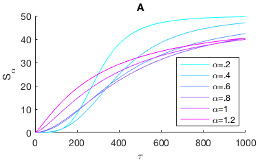

<<<<<<< HEAD
Figure 2: 8 controls
8
of 8
in the 8 system.
In panel A, we show the response of 8
, in units of 8
/8,
as 8 increases.
Several values of 8 are shown.
Using 8
allows us to infer 8
from observations of 8
in 8
In panel B, we compare the resulting estimations of 8
in units of 8
Data are shown for two conditions, 8 and 8
Overlaid curves are best fits of the 8 model
and the 8 model.
=======
Figure 2: Many beautiful positive controls of
of growth
in the ??? system.
In panel A, we show the response of teta
, in units of mg ([0, 1000])
/week,
as .2 increases.
Several values of alpha are shown.
Using different values of alpha
allows us to infer ???
from observations of ???
in ???.
In panel B, we compare the resulting estimations of Effective Lobster Dancing coefficient
in units of log(Lobsters per Lobster trap).
Data are shown for two conditions, lobsters boiled in salt water (B7) and raw lobsters (alm).
Overlaid curves are best fits of the ??? model
and the ??? model.
>>>>>>> 908d3a8fff70b879933643c90959e8991b06c82e
