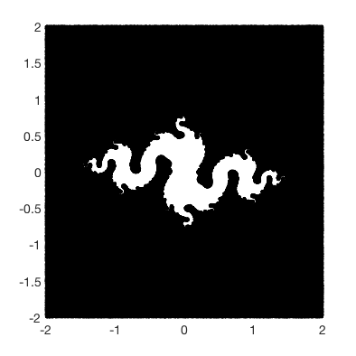
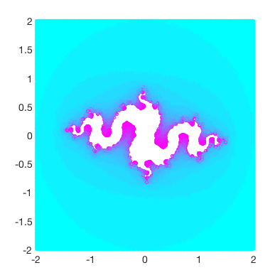
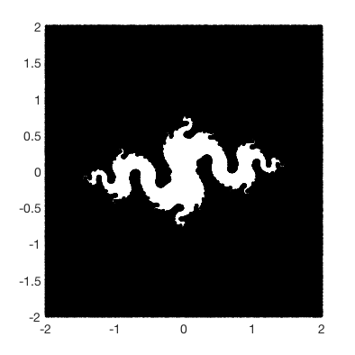
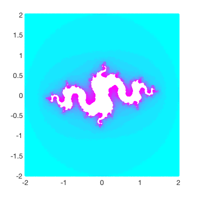

<<<<<<< HEAD
Figure: Four Julia fractals. Points in the Julia set are colored black. Points not in the Julia set are white. The parameters used for the four plots were: ((enter your four c's here))
-.5 - 0.3*i;
-.9 - 0.1*i;
-.99 - 0.01*i;
-0.8 - 0.156*i;
=======
Figure: Four Julia fractals. Points in the Julia set are black in the panels on the left, and colored on the right. Points not in the Julia set are white. The parameters used for the four plots were: -0.8 + 0.156i for the top set, -0.8 - 0.156i
for the bottom set.
>>>>>>> 908d3a8fff70b879933643c90959e8991b06c82e
